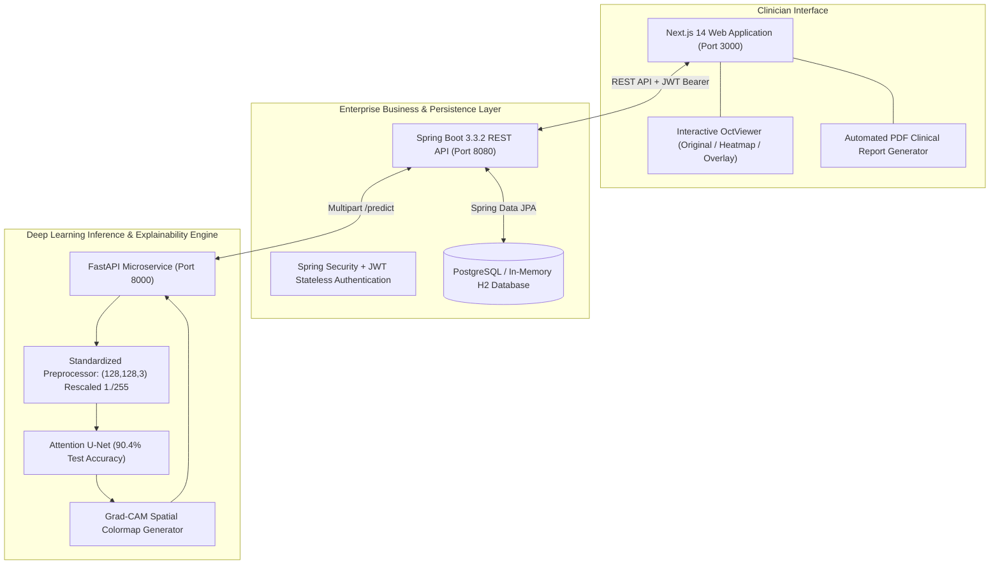

# RETINAAI: Explainable AI-Powered OCT Retinal Screening

<div align="center">

**"See Beyond the Scan."**

[](https://nextjs.org/)
[](https://spring.io/projects/spring-boot)
[](https://fastapi.tiangolo.com/)
[](https://tensorflow.org/)
[](https://www.docker.com/)

*A clinical-grade, end-to-end retinal screening platform combining high-capacity Attention U-Net deep learning with transparent Grad-CAM explainability, clinical priority triage, and automated PDF report generation.*

[Quick Start](#-quick-start) | [System Architecture](#-system-architecture) | [Model Benchmarks](#-research-models--benchmarks) | [Live Demo Flow](#-live-demo-flow-for-judges)

</div>

---

## Executive Summary

Retinal diseases such as **Choroidal Neovascularization (CNV)**, **Diabetic Macular Edema (DME)**, and **Drusen (Age-Related Macular Degeneration)** are among the leading causes of irreversible vision loss worldwide. While Optical Coherence Tomography (OCT) is the clinical gold standard for non-invasive cross-sectional imaging of the retina, manual interpretation creates a critical bottleneck for ophthalmologists.

**RetinaAI** bridges the gap between research and clinical practice:
- **Transparent AI Decision Support**: Instead of a black-box output, RetinaAI generates real-time **Grad-CAM spatial attention maps** to visualize exactly which retinal layers (fluid cavities, drusen summits, subretinal membranes) drove the AI decision.
- **Production Champion Model**: Leverages a state-of-the-art **Attention U-Net** architecture (90.4% reported test accuracy) trained on standardized OCT2017 medical partitions with `(128, 128, 3)` dimensions and `1./255` normalization.
- **Clinical Priority Triage**: Automatically categorizes scans into actionable urgency tiers (`HIGH` priority for active CNV/DME, `CLINICAL REVIEW` for Drusen, and `LOW RISK` for Normal retinas).
- **Automated PDF Clinical Reports**: One-click generation of standardized clinical screening reports complete with class probabilities, attention rationale, and legal disclaimers.

---

## Target Pathologies (4-Class Classification)

| Pathology | Clinical Description | Screening Priority | AI Biomarker Localization |
| :--- | :--- | :---: | :--- |
| **NORMAL** | Intact, continuous foveal depression with well-stratified retinal layers and absence of fluid or drusen. | `LOW RISK` | Distributed baseline across healthy RPE layer. |
| **DME** | Diabetic Macular Edema; intraretinal cystoid fluid accumulation and retinal thickening. | `HIGH PRIORITY` | Hyporeflective intraretinal cystoid fluid cavities. |
| **DRUSEN** | Focal nodular deposits of extracellular material between the RPE and Bruch membrane (early/intermediate AMD). | `CLINICAL REVIEW` | Convex sub-RPE elevations and undulations. |
| **CNV** | Choroidal Neovascularization; active neovascular membrane breaching Bruch membrane (wet AMD). | `HIGH PRIORITY` | Hyperreflective subretinal membrane complex. |

---

## System Architecture



---

## Research Models & Benchmarks

RetinaAI catalogs the complete progression of 8 neural network architectures evaluated on the OCT2017 dataset (83,493 total scans):

| Architecture | Model Family | Parameter Count | Reported Test Accuracy | Reported Loss | Status in RetinaAI |
| :--- | :--- | :---: | :---: | :---: | :--- |
| **Deep CNN** | Sequential Baseline | 5,111,492 | **74.0%** | 0.6899 | Research Benchmark |
| **FCN** | All-Convolutional | 1,572,548 | **85.0%** | 0.4936 | Research Benchmark |
| **Baseline U-Net** | Encoder-Decoder | ~14.8M | **85.0%** | 0.4070 | Research Benchmark |
| **U-Net + Dropout** | Regularized U-Net | ~15.2M | **85.8%** | 0.3850 | Research Benchmark |
| **U-Net + Filters** | High-Capacity U-Net | ~34.1M | **86.8%** | 0.3620 | Research Benchmark |
| **U-Net + Res Blocks** | Residual Skip U-Net | ~19.8M | **88.6%** | 0.3410 | Research Benchmark |
| **ResU-Net** | Deep Residual U-Net | ~28.2M | **90.5%** | 0.3124 | Evaluated Benchmark |
| **Attention U-Net** | Gated Attention | ~31.4M | **90.4%** | **0.2980** | **Production Champion** |

---

## Project Structure

```
retina-ai/
|-- ai-service/                         # Python FastAPI AI Inference Service
|   |-- app/
|   |   |-- main.py                     # Endpoints (/health, /predict, /models, /analytics)
|   |   |-- inference.py                # Attention U-Net Inference Engine
|   |   |-- gradcam.py                  # Grad-CAM Attention Heatmap & Overlay Generator
|   |   |-- preprocess.py               # Image Normalization (128, 128, 3, 1./255)
|   |   |-- model_factory.py            # Architectural Registry for all 8 Notebook Models
|   |   +-- class_names.json            # Authoritative Pathologies & Triage Rules
|   |-- models/                         # Local Keras Weights Directory (.keras / .h5)
|   |-- requirements.txt                # Python Dependencies
|   +-- Dockerfile
|
|-- backend/                            # Java Spring Boot 3.3.2 Enterprise Backend
|   |-- src/main/java/com/retinaai/
|   |   |-- config/                     # SecurityConfig, JwtTokenProvider, CorsConfig
|   |   |-- controller/                 # Auth, Scan, Report, Analytics, ModelLab Controllers
|   |   |-- dto/                        # Request/Response Data Transfer Objects
|   |   |-- entity/                     # User, Scan, Prediction, Report (JPA Entities)
|   |   |-- repository/                 # Spring Data JPA Repositories
|   |   +-- service/                    # Business Logic, AI Client, PDF Metadata Services
|   |-- src/main/resources/
|   |   +-- application.yml             # Dual PostgreSQL / H2 Database Config
|   |-- pom.xml                         # Maven Configuration (Java 21 / Spring Boot 3)
|   +-- Dockerfile
|
|-- frontend/                           # Next.js 14 App Router Clinical Web Application
|   |-- app/
|   |   |-- page.tsx                    # Landing Page ("See Beyond the Scan")
|   |   |-- login/page.tsx              # Clinician Sign-In (+ 1-Click Demo Login)
|   |   |-- register/page.tsx           # Clinician Registration
|   |   |-- dashboard/page.tsx          # Real-Time Screening Dashboard & Charts
|   |   |-- analyze/page.tsx            # OCT Drag & Drop Upload & 1-Click Samples
|   |   |-- results/[id]/page.tsx       # Interactive Visualizer, 4-Class Scores & PDF Export
|   |   |-- history/page.tsx            # Searchable / Filterable Patient Archive
|   |   |-- reports/page.tsx            # Clinical Reports Directory
|   |   |-- analytics/page.tsx          # OCT2017 Dataset & Model Comparison Benchmarks
|   |   +-- models/page.tsx             # Interactive Model Architecture Lab
|   |-- components/                     # OctViewer, ProbabilityBar, PriorityBadge, Navbar, Footer
|   |-- lib/                            # API Client, Auth Context, PDF Generator
|   +-- package.json
|
|-- docs/                               # Hackathon Pitch & Documentation
|   |-- HACKATHON.md                    # Problem, Solution, Architecture & Demo Flow
|   +-- PITCH.md                        # 2-Minute Elevator Pitch for Judges
|
|-- sample-scans/                       # Ready-to-Use OCT Scans (NORMAL, DME, DRUSEN, CNV)
|-- docker-compose.yml                  # Full-Stack Multi-Container Orchestration
+-- README.md                           # Documentation
```

---

## Quick Start

### Option A: Docker Compose (Zero-Setup / Recommended)

Prerequisites: [Docker Desktop](https://www.docker.com/products/docker-desktop/)

```bash
cd retina-ai
docker-compose up --build
```
- **Frontend UI**: `http://localhost:3000`
- **Spring Boot Backend**: `http://localhost:8080/api`
- **FastAPI AI Service**: `http://localhost:8000/docs`

---

### Option B: Local Execution (Step-by-Step)

#### Prerequisites
- **Python 3.10+**
- **Java 21+ & Maven 3.9+**
- **Node.js 18+ & npm**

#### 1. Start AI Inference Service
```bash
cd retina-ai/ai-service
pip install -r requirements.txt
python -m uvicorn app.main:app --host 0.0.0.0 --port 8000 --reload
```
*Health Check: `http://localhost:8000/health`*

#### 2. Start Spring Boot Backend
```bash
cd retina-ai/backend
mvn spring-boot:run
```
*Backend API running at: `http://localhost:8080/api` (Swagger UI at `http://localhost:8080/swagger-ui.html`)*  
*Note: Uses automatic in-memory H2 database with zero configuration, or PostgreSQL if `DATABASE_URL` is set.*

#### 3. Start Next.js Frontend
```bash
cd retina-ai/frontend
npm install
npm run dev
```
*Frontend running at: `http://localhost:3000`*

---

## Live Demo Flow for Judges

1. **Explore Landing Page** (`/`): Inspect value proposition, technology breakdown, and supported retinal conditions.
2. **1-Click Hackathon Login** (`/login`): Click **"1-Click Hackathon Demo Login"** to instantly authenticate as Dr. Sarah Lin (Retinal Specialist).
3. **Upload OCT Scan** (`/analyze`):
   - Drag and drop a file from `retina-ai/sample-scans/`, or
   - Click any button in **"Quick Test: Load Sample OCT Scans"** (`NORMAL`, `DME`, `DRUSEN`, `CNV`).
4. **Live Inference Execution**: Observe the real-time progressive pipeline (Upload -> Preprocessing -> Attention U-Net Inference -> Grad-CAM Generation).
5. **Interactive Result Studio** (`/results/[id]`):
   - Review top diagnosis and exact confidence score.
   - Inspect the **4-Class Probability Distribution** chart.
   - Use **OctViewer** to toggle between **Original OCT**, **Heatmap**, and **Overlay** views to inspect where the model focused.
6. **Download Clinical Report**: Click **"Download Clinical Report"** to instantly compile and download a standardized clinical PDF summary.
7. **Inspect Model Lab & Analytics** (`/models` & `/analytics`): Show judges the comparison matrix of all 8 architectures and dataset distributions.

---

## API Endpoints Reference

### Authentication (`/api/auth`)
- `POST /api/auth/register` - Register a new clinician
- `POST /api/auth/login` - Authenticate and receive JWT token

### Scans & Screening (`/api/scans`)
- `POST /api/scans` - Upload OCT B-scan and execute AI inference
- `GET /api/scans` - List clinician scan history
- `GET /api/scans/{id}` - Retrieve detailed scan result with Grad-CAM images
- `DELETE /api/scans/{id}` - Remove a scan record
- `GET /api/scans/dashboard/stats` - Fetch aggregated dashboard metrics

### Reports (`/api/reports`)
- `POST /api/reports/{scanId}` - Generate clinical PDF metadata report
- `GET /api/reports` - List all generated clinical reports

### Model Lab & Analytics (`/api/models`, `/api/analytics`)
- `GET /api/models` - Catalog of all 8 deep learning architectures
- `GET /api/analytics` - OCT2017 dataset breakdown and benchmark metrics

---

## Medical Disclaimer

> **IMPORTANT**: *RetinaAI is an AI-assisted screening research tool designed for clinical decision support. Predictions and Grad-CAM attention heatmaps do not constitute autonomous medical diagnoses. All screening findings must be clinically correlated by a licensed ophthalmologist or certified eye care specialist.*
